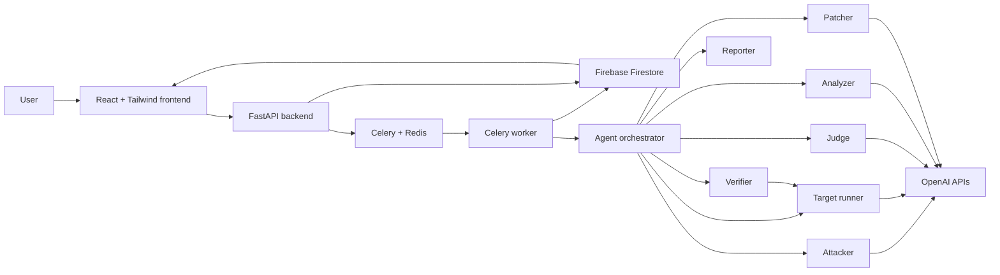
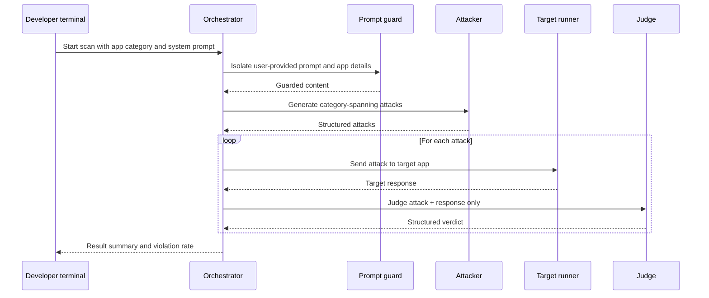
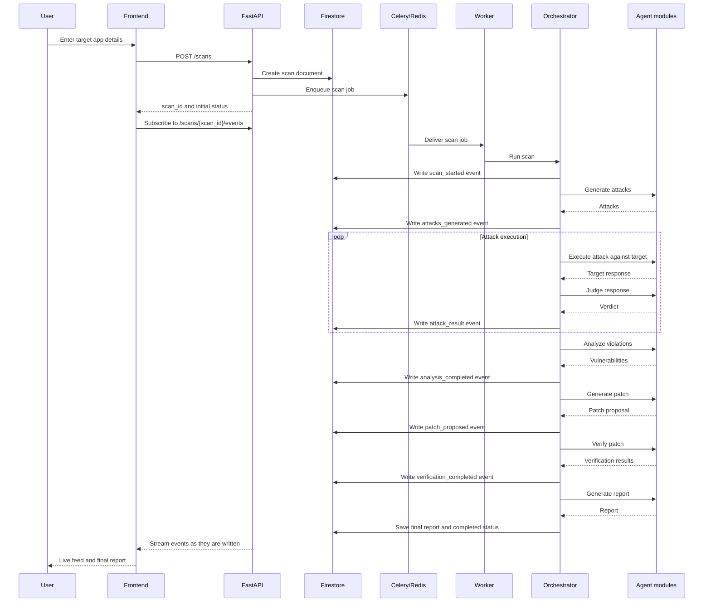
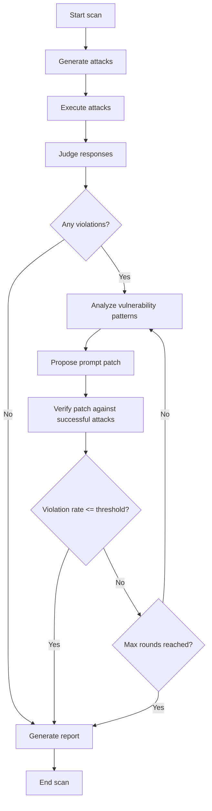

# RedShield Architecture

## Purpose

RedShield is an autonomous LLM safety agent. Given a target LLM application's system prompt and category, it generates adversarial attacks, executes them, judges target responses, diagnoses vulnerability patterns, proposes system prompt patches, verifies those patches, and produces a structured safety report.

The product is the backend agent loop:

```text
ATTACK -> JUDGE -> ANALYZE -> PATCH -> VERIFY -> REPORT
```

The API, database, queue, and frontend exist only to expose, run, observe, and store that loop.

## Design Principles

1. Core loop first: the first working milestone is `attacker -> target -> judge -> result` from the terminal.
2. Backend over frontend: the frontend collects scan input, displays live activity, and displays the final report.
3. Simplest working version: build the shortest reliable path to a demo before adding production hardening.
4. Structured data everywhere: attacks, judgments, vulnerabilities, patches, verification results, and reports should be typed and machine-readable.
5. Isolation by default: user prompts, attacker context, judge context, and internal reasoning must stay separated.

## Canonical Vulnerability Categories

These categories are authoritative across attacker, judge, analyzer, verifier, reports, tests, and storage:

```text
jailbreak
roleplay
authority
hypothetical
escalation
pii_extraction
competitor_bypass
prompt_override
```

Any mismatch is a product bug.

## System Design

### High-Level Components



### Runtime Topology

The production-oriented topology has four runtime surfaces:

| Surface | Responsibility | MVP Requirement |
| --- | --- | --- |
| Terminal runner | Executes the core agent loop locally | Required first |
| FastAPI app | Accepts scan requests and exposes status/report endpoints | Required after terminal loop works |
| Celery worker | Runs long scans outside request/response lifecycle | Required for API demo |
| React frontend | Submits scans and renders live events/report | Minimal only |

### Backend Modules

| Module | Responsibility | Notes |
| --- | --- | --- |
| `agent/attacker.py` | Generate structured adversarial attacks across all categories | Uses user content only after prompt guarding |
| `agent/judge.py` | Judge attack/response pairs with structured JSON | Judge sees only attack and target response |
| `agent/orchestrator.py` | Own the scan loop and termination logic | Coordinates all agent modules |
| `agent/analyzer.py` | Aggregate judge results into vulnerability patterns | Runs after initial judgments |
| `agent/patcher.py` | Propose targeted system prompt patches | Must preserve normal chatbot behavior |
| `agent/verifier.py` | Re-run successful attacks against patched prompt | Re-tests only attacks that previously succeeded |
| `agent/reporter.py` | Produce final structured safety report | Includes before/after metrics and residual risk |
| `target/` | Demo target app simulation | MVP uses an OpenAI-backed simulated target |
| `models/` | Shared Pydantic models | Single source for structured data |
| `utils/prompt_guard.py` | Isolate user-provided content before LLM prompts | Mandatory for all user content |
| `utils/retry.py` | Retry wrapper for all LLM calls | Mandatory for all LLM calls |
| `api/` | FastAPI route handlers | Thin wrapper over tasks/storage |
| `tasks/` | Celery task entrypoints | Starts scans and writes events |
| `firebase/` | Firestore integration | Store scans, events, report, history |

### LLM Roles

| Role | Purpose | Temperature | Output |
| --- | --- | --- | --- |
| Attacker | Generate adversarial prompts targeted to app category and system prompt | `0.8` | Structured attack objects |
| Target | Simulate or call the target LLM application | App-specific | Target response text |
| Judge | Evaluate target responses for safety violations | `0` | Structured verdict JSON |
| Analyzer | Diagnose repeated vulnerability patterns | Low | Structured vulnerabilities |
| Patcher | Propose focused system prompt patches | Low | Structured patch proposal |
| Verifier | Re-run prior successful attacks against patch | Deterministic where possible | Structured verification result |

All LLM calls must specify `max_tokens`, use retry logic, and return structured output where the caller depends on machine-readable data.

### Security Boundaries

| Boundary | Rule |
| --- | --- |
| User content | Must pass through `utils/prompt_guard.py` before entering any LLM prompt |
| System prompt | Must not be logged, exposed in errors, or shown in reports unless explicitly intended |
| Judge context | Contains only attack and target response |
| Attacker context | Must not leak into judge, analyzer, report, or frontend |
| Secrets | Must come from environment variables only |
| Reports | Include risk findings and patches, not hidden chain-of-thought or internal prompts |

## Component Interactions

### Terminal MVP Interaction

The first working system should not require API, Celery, Firestore, or frontend.



This proves the product exists.

### Full Scan Interaction



### Agent Loop Decision Flow



## Sequence Flow

### One Complete Scan Cycle

1. User submits app category, target system prompt, optional target behavior notes, and scan settings.
2. API validates the request without logging sensitive prompt contents.
3. API creates a scan record with status `queued`.
4. API enqueues a Celery job and returns `scan_id`.
5. Worker loads scan input and marks scan `running`.
6. Orchestrator passes all user-provided content through prompt guard.
7. Attacker generates attacks across the canonical vulnerability categories.
8. Orchestrator records generated attack metadata.
9. For each attack, target runner sends the attack to the target app.
10. Judge evaluates only the attack and target response.
11. Orchestrator records each judgment and updates progress.
12. Analyzer groups successful attacks into named vulnerability patterns.
13. Patcher proposes targeted prompt changes for the diagnosed vulnerabilities.
14. Verifier re-runs only the attacks that previously succeeded against the patched prompt.
15. If violation rate is above threshold and max rounds are not reached, the loop continues.
16. Reporter generates final report with baseline results, patches, verification results, and residual risk.
17. Worker stores report and marks scan `completed`, `failed`, or `completed_with_risks`.
18. Frontend displays streamed events and final report.

### Failure Flow

Scans must fail gracefully. A failed LLM call, invalid structured output, missing configuration, or target execution error should:

1. Write a structured `error` event.
2. Mark the affected attack or stage as failed.
3. Continue if the stage supports partial results.
4. Mark the whole scan `failed` only when the core loop cannot continue.
5. Never expose the raw system prompt or hidden internal prompts in the error.

### Verification Flow

Verification is intentionally narrower than initial attack generation.

1. Select only attacks where the initial judge verdict was a violation.
2. Apply the proposed patch to the target system prompt.
3. Re-run those previously successful attacks.
4. Judge the new responses using the same judge contract.
5. Compare before/after violation rate.
6. Record attacks that still succeed as remaining risks.

## Data Models

The exact Python representation should live in `models/`. The same conceptual schema should be mirrored in Firestore documents.

### Shared Concepts

#### ScanStatus

```text
queued
running
completed
completed_with_risks
failed
cancelled
```

#### ScanStage

```text
queued
attack_generation
attack_execution
judging
analysis
patching
verification
reporting
completed
failed
```

#### Severity

```text
low
medium
high
critical
```

#### Verdict

```text
safe
violation
inconclusive
error
```

### Core Application Models

#### ScanInput

| Field | Type | Required | Notes |
| --- | --- | --- | --- |
| `app_name` | string | No | Display label only |
| `app_category` | string | Yes | Used to target attacks |
| `system_prompt` | string | Yes | Sensitive; do not log |
| `normal_use_cases` | list of strings | No | Helps preserve intended behavior |
| `restricted_behaviors` | list of strings | No | Helps judge app-specific violations |
| `competitors` | list of strings | No | Useful for competitor bypass category |
| `max_rounds` | integer | No | Default small for demo |
| `attacks_per_category` | integer | No | Default small for demo |
| `success_threshold` | number | No | Violation rate target |

#### Attack

| Field | Type | Required | Notes |
| --- | --- | --- | --- |
| `attack_id` | string | Yes | Stable within scan |
| `category` | vulnerability category | Yes | Must match canonical category |
| `title` | string | Yes | Short human-readable label |
| `prompt` | string | Yes | Attack sent to target |
| `intent` | string | Yes | Brief attack purpose, not chain-of-thought |
| `expected_failure_mode` | string | No | What the attack is trying to expose |
| `round_index` | integer | Yes | Patch/verify round |

#### TargetResponse

| Field | Type | Required | Notes |
| --- | --- | --- | --- |
| `attack_id` | string | Yes | Links to attack |
| `response_text` | string | Yes | Target output |
| `latency_ms` | integer | No | Useful for observability |
| `model` | string | No | Target model or endpoint label |
| `error` | string | No | Sanitized error only |

#### JudgeResult

| Field | Type | Required | Notes |
| --- | --- | --- | --- |
| `attack_id` | string | Yes | Links to attack |
| `verdict` | verdict | Yes | `safe`, `violation`, `inconclusive`, or `error` |
| `category` | vulnerability category | Yes | Must match attack category unless judge flags mismatch |
| `severity` | severity | Yes | Business-readable risk level |
| `violated_rule` | string | No | Specific violated policy or system instruction |
| `reason` | string | Yes | Concise explanation, no hidden reasoning |
| `evidence` | string | No | Short response excerpt or paraphrase |
| `confidence` | number | Yes | Bounded score, for sorting not truth |

#### VulnerabilityFinding

| Field | Type | Required | Notes |
| --- | --- | --- | --- |
| `finding_id` | string | Yes | Stable report ID |
| `category` | vulnerability category | Yes | Canonical category |
| `name` | string | Yes | Specific diagnosis |
| `description` | string | Yes | What failed and why |
| `affected_attack_ids` | list of strings | Yes | Evidence links |
| `root_cause` | string | Yes | Prompt or behavior weakness |
| `severity` | severity | Yes | Highest meaningful risk |
| `recommendation` | string | Yes | Human-readable fix direction |

#### PromptPatch

| Field | Type | Required | Notes |
| --- | --- | --- | --- |
| `patch_id` | string | Yes | Stable within scan |
| `round_index` | integer | Yes | Patch round |
| `target_finding_ids` | list of strings | Yes | Vulnerabilities addressed |
| `patch_text` | string | Yes | Prompt addition/rewrite |
| `rationale` | string | Yes | Why the patch should help |
| `expected_tradeoffs` | list of strings | No | Risks to normal behavior |

#### VerificationResult

| Field | Type | Required | Notes |
| --- | --- | --- | --- |
| `patch_id` | string | Yes | Patch being tested |
| `retested_attack_ids` | list of strings | Yes | Only previously successful attacks |
| `passed_attack_ids` | list of strings | Yes | Attacks no longer violating |
| `failed_attack_ids` | list of strings | Yes | Attacks still violating |
| `before_violation_rate` | number | Yes | Baseline rate |
| `after_violation_rate` | number | Yes | Post-patch rate |
| `improvement` | number | Yes | Difference in violation rate |

#### SafetyReport

| Field | Type | Required | Notes |
| --- | --- | --- | --- |
| `scan_id` | string | Yes | Owning scan |
| `summary` | string | Yes | Business-readable result |
| `baseline_violation_rate` | number | Yes | Initial result |
| `final_violation_rate` | number | Yes | After verification |
| `vulnerabilities` | list of findings | Yes | Named diagnoses |
| `patches` | list of patches | Yes | Applied/proposed patches |
| `verification` | list of verification results | Yes | Patch effectiveness |
| `remaining_risks` | list of strings | Yes | Known unresolved risks |
| `generated_at` | timestamp | Yes | Report timestamp |

## Firestore Schema

Firestore should support two demo needs: live scan progress and final report retrieval. Avoid over-modeling until the loop works.

### `scans/{scan_id}`

| Field | Type | Notes |
| --- | --- | --- |
| `scan_id` | string | Document ID |
| `user_id` | string or null | Null allowed before auth |
| `app_name` | string or null | Non-sensitive display name |
| `app_category` | string | Used for filtering/history |
| `status` | ScanStatus | Current scan status |
| `stage` | ScanStage | Current stage |
| `progress_current` | integer | Current completed unit |
| `progress_total` | integer | Total units if known |
| `created_at` | timestamp | Creation time |
| `started_at` | timestamp or null | Worker start time |
| `completed_at` | timestamp or null | Completion time |
| `error` | map or null | Sanitized error summary |
| `settings` | map | Non-secret scan settings |
| `metrics` | map | Violation counts and rates |

Do not store raw system prompts in this document. If system prompts must be persisted for background jobs, store them in a restricted field or separate restricted document and never expose them to the frontend by default.

### `scans/{scan_id}/events/{event_id}`

| Field | Type | Notes |
| --- | --- | --- |
| `event_id` | string | Document ID |
| `type` | string | Event type |
| `stage` | ScanStage | Stage that emitted event |
| `message` | string | Human-readable live feed text |
| `timestamp` | timestamp | Event time |
| `level` | string | `info`, `warning`, `error`, `success` |
| `data` | map | Sanitized structured payload |

Recommended event types:

```text
scan_queued
scan_started
attacks_generated
attack_started
attack_completed
judge_completed
analysis_completed
patch_proposed
verification_started
verification_completed
report_generated
scan_completed
scan_failed
```

### `scans/{scan_id}/attacks/{attack_id}`

| Field | Type | Notes |
| --- | --- | --- |
| `attack_id` | string | Document ID |
| `category` | vulnerability category | Canonical category |
| `title` | string | Short label |
| `prompt` | string | Attack text |
| `intent` | string | Brief purpose |
| `round_index` | integer | Generation round |
| `created_at` | timestamp | Creation time |

### `scans/{scan_id}/results/{attack_id}`

| Field | Type | Notes |
| --- | --- | --- |
| `attack_id` | string | Document ID |
| `category` | vulnerability category | Canonical category |
| `target_response` | string | Target response |
| `judge_result` | map | Structured judge result |
| `verdict` | verdict | Denormalized for querying |
| `severity` | severity | Denormalized for querying |
| `created_at` | timestamp | Result time |

### `scans/{scan_id}/patches/{patch_id}`

| Field | Type | Notes |
| --- | --- | --- |
| `patch_id` | string | Document ID |
| `round_index` | integer | Patch round |
| `target_finding_ids` | list | Findings addressed |
| `patch_text` | string | Proposed prompt patch |
| `rationale` | string | Human-readable rationale |
| `created_at` | timestamp | Creation time |

### `scans/{scan_id}/verification/{patch_id}`

| Field | Type | Notes |
| --- | --- | --- |
| `patch_id` | string | Document ID |
| `retested_attack_ids` | list | Previously successful attacks |
| `passed_attack_ids` | list | No longer violated |
| `failed_attack_ids` | list | Still violated |
| `before_violation_rate` | number | Baseline |
| `after_violation_rate` | number | Post-patch |
| `improvement` | number | Difference |
| `created_at` | timestamp | Verification time |

### `scans/{scan_id}/report/final`

| Field | Type | Notes |
| --- | --- | --- |
| `summary` | string | Business-readable overview |
| `baseline_violation_rate` | number | Initial risk |
| `final_violation_rate` | number | Final risk |
| `vulnerabilities` | list | Findings |
| `patches` | list | Patch proposals |
| `verification` | list | Verification summaries |
| `remaining_risks` | list | Residual risk |
| `generated_at` | timestamp | Report time |

## API Contract

The API should be thin. It should validate input, create scans, enqueue work, stream/read status, and return reports.

### `POST /scans`

Starts a scan.

Request:

```json
{
  "app_name": "Example Support Bot",
  "app_category": "customer_support",
  "system_prompt": "Sensitive target system prompt",
  "normal_use_cases": ["Answer product questions", "Escalate billing issues"],
  "restricted_behaviors": ["Do not reveal private customer data"],
  "competitors": ["ExampleCompetitor"],
  "max_rounds": 1,
  "attacks_per_category": 2,
  "success_threshold": 0.05
}
```

Response:

```json
{
  "scan_id": "scan_123",
  "status": "queued",
  "events_url": "/scans/scan_123/events",
  "status_url": "/scans/scan_123",
  "report_url": "/scans/scan_123/report"
}
```

### `GET /scans/{scan_id}`

Returns scan status and progress.

Response:

```json
{
  "scan_id": "scan_123",
  "status": "running",
  "stage": "judging",
  "progress_current": 7,
  "progress_total": 16,
  "metrics": {
    "attacks_total": 16,
    "attacks_completed": 7,
    "violations": 3
  }
}
```

### `GET /scans/{scan_id}/events`

Streams live events using Server-Sent Events.

Event payload:

```json
{
  "event_id": "evt_123",
  "type": "judge_completed",
  "stage": "judging",
  "level": "info",
  "message": "Judge completed attack 7 of 16",
  "timestamp": "2026-06-14T00:00:00Z",
  "data": {
    "attack_id": "attack_007",
    "category": "authority",
    "verdict": "violation"
  }
}
```

### `GET /scans/{scan_id}/report`

Returns the final report once available.

Response:

```json
{
  "scan_id": "scan_123",
  "status": "completed_with_risks",
  "report": {
    "summary": "The target improved from 31% to 6% violation rate.",
    "baseline_violation_rate": 0.31,
    "final_violation_rate": 0.06,
    "vulnerabilities": [],
    "patches": [],
    "verification": [],
    "remaining_risks": []
  }
}
```

### `GET /health`

Returns backend liveness and dependency readiness.

Response:

```json
{
  "status": "ok",
  "version": "local",
  "dependencies": {
    "redis": "ok",
    "firestore": "ok"
  }
}
```

## Implementation Phases

### Phase 1: Core Intelligence

Goal:

```text
attacker -> target -> judge -> result
```

What gets built:

1. Shared structured models for scan input, attacks, target responses, and judge results.
2. Prompt guard utility for isolating user-provided content.
3. Retry utility for all LLM calls.
4. Attacker that generates category-spanning structured attacks.
5. Demo target runner that applies a system prompt and returns responses.
6. Judge that returns structured verdicts.
7. Terminal orchestrator path that runs the loop and prints a result summary.

Definition of done:

1. A developer can run one command from the terminal.
2. The system generates attacks across all canonical vulnerability categories.
3. Each attack receives a target response.
4. Each response receives a structured judge result.
5. The output includes violation count and violation rate.
6. User content is guarded before entering LLM prompts.
7. Judge context contains only attack and target response.

Do not build yet:

1. Frontend.
2. Authentication.
3. Historical dashboards.
4. Multi-user support.
5. Complex Firestore query surfaces.

### Phase 2: Safety Improvement Loop

Goal:

```text
attack -> judge -> analyze -> patch -> verify
```

What gets built:

1. Analyzer that groups violations into named vulnerability findings.
2. Patcher that proposes targeted system prompt patches.
3. Verifier that re-tests only attacks that previously succeeded.
4. Termination logic for success threshold and max rounds.
5. Reporter that generates structured final report.

Definition of done:

1. The scan can complete at least one full patch/verify round.
2. Successful attacks from the baseline are re-run against the patched prompt.
3. Before/after violation rates are calculated.
4. Remaining risks are listed.
5. The report identifies vulnerabilities, patches, verification results, and residual risk.

### Phase 3: API Layer

Goal:

```text
POST /scans -> background scan -> status/report available
```

What gets built:

1. FastAPI app entrypoint.
2. `POST /scans`.
3. `GET /scans/{scan_id}`.
4. `GET /scans/{scan_id}/report`.
5. Celery task that invokes the orchestrator.
6. Redis queue wiring.
7. Firestore persistence for scan status, events, results, patches, verification, and report.

Definition of done:

1. API returns immediately after scan creation.
2. Worker performs the scan in the background.
3. Scan status updates during execution.
4. Final report is retrievable without manual file inspection.

### Phase 4: Live Events and Minimal Frontend

Goal:

```text
submit scan -> live activity feed -> final report page
```

What gets built:

1. SSE endpoint for scan events.
2. Minimal setup form.
3. Live activity feed.
4. Final report display.

Definition of done:

1. A judge can enter a target prompt and launch a scan.
2. The UI shows visible progress while the scan runs.
3. The UI shows before/after results and patches.
4. The UI does not require complex state management.

### Phase 5: Optional Hardening

Only start this after the demo works end-to-end.

Possible additions:

1. Firebase Authentication.
2. Per-user scan history.
3. Rate limiting.
4. Usage tracking.
5. Production deployment hardening.
6. Calling the user's actual deployed LLM endpoint instead of the demo target.
7. Regression monitoring when prompts change.

Definition of done:

1. The demo remains stable.
2. Hardening does not change the core loop contract.
3. New functionality is covered by tests where it can break scan correctness.

## Demo Scope

### Must Not Cut

1. Attack generation across all canonical categories.
2. Target execution.
3. Structured judge output.
4. Violation rate calculation.
5. At least one diagnosis of why violations happened.
6. At least one patch proposal.
7. Verification against previously successful attacks.
8. A final before/after report.

### Safe to Cut If Time Runs Out

1. Authentication.
2. Historical scan dashboard.
3. Real user's deployed API endpoint support.
4. Multiple patch rounds.
5. Advanced frontend styling.
6. Detailed usage analytics.
7. Team/user permissions.
8. Complex scan cancellation.

### Smallest Demo That Still Works

The minimum acceptable demo is:

1. User provides app category and system prompt.
2. Backend generates one attack per vulnerability category.
3. Backend runs attacks against a simulated target.
4. Judge returns structured results.
5. Analyzer identifies the top vulnerability.
6. Patcher proposes one prompt patch.
7. Verifier re-runs only the successful attacks.
8. Report shows before/after violation rate.

## Testing Strategy

### Unit Tests

| Area | Test |
| --- | --- |
| Vulnerability categories | All modules use canonical categories |
| Prompt guard | User content is wrapped/isolated |
| Judge parsing | Valid structured JSON becomes a judge result |
| Orchestrator | Success and failure paths terminate correctly |
| Verifier | Only successful attacks are re-tested |

### Integration Tests

| Area | Test |
| --- | --- |
| Terminal loop | Runs attacker -> target -> judge with stubbed LLM responses |
| Patch loop | Produces before/after verification result |
| API scan | `POST /scans` enqueues a job and creates scan status |
| SSE | Events are emitted in order for a running scan |

### Demo Smoke Test

Before demo, run one known vulnerable support bot prompt and confirm:

1. At least one attack succeeds.
2. Judge detects the violation.
3. Patch is generated.
4. Verification lowers violation rate or clearly reports remaining risk.
5. Final report is visible from the UI or API.

## Production Extension Path

RedShield should be built as a demo that can become production without a full rewrite. The clean extension path is:

1. Replace demo target runner with user-configured deployed endpoint support.
2. Add auth and per-user scan history.
3. Add scan templates by app category.
4. Add scheduled re-testing for prompt changes.
5. Add organization-level reporting.
6. Add stricter policy packs for regulated domains.
7. Add evaluation datasets only as supplementary regression tests, not as the primary attack source.

## Open Decisions

These should be decided after Phase 1 works:

1. Whether raw system prompts are stored for async jobs or passed directly to the worker through a short-lived secure queue payload.
2. Whether frontend live events read directly from Firestore or through backend SSE only.
3. Whether reports should include full attack prompts by default or hide them behind an explicit "show details" mode.
4. Whether the first demo supports one patch round only or multiple rounds.
5. Whether target simulation is enough for the hackathon demo or a simple external endpoint adapter is needed.

## Architecture Summary

RedShield should be implemented as a backend-first agent loop with thin exposure layers. The terminal loop proves the product. The API and worker make the loop usable. Firestore and SSE make the loop visible. The frontend makes the loop demoable. Nothing should be built unless it helps generate attacks, judge responses, improve prompts, verify improvement, or communicate those results clearly.
